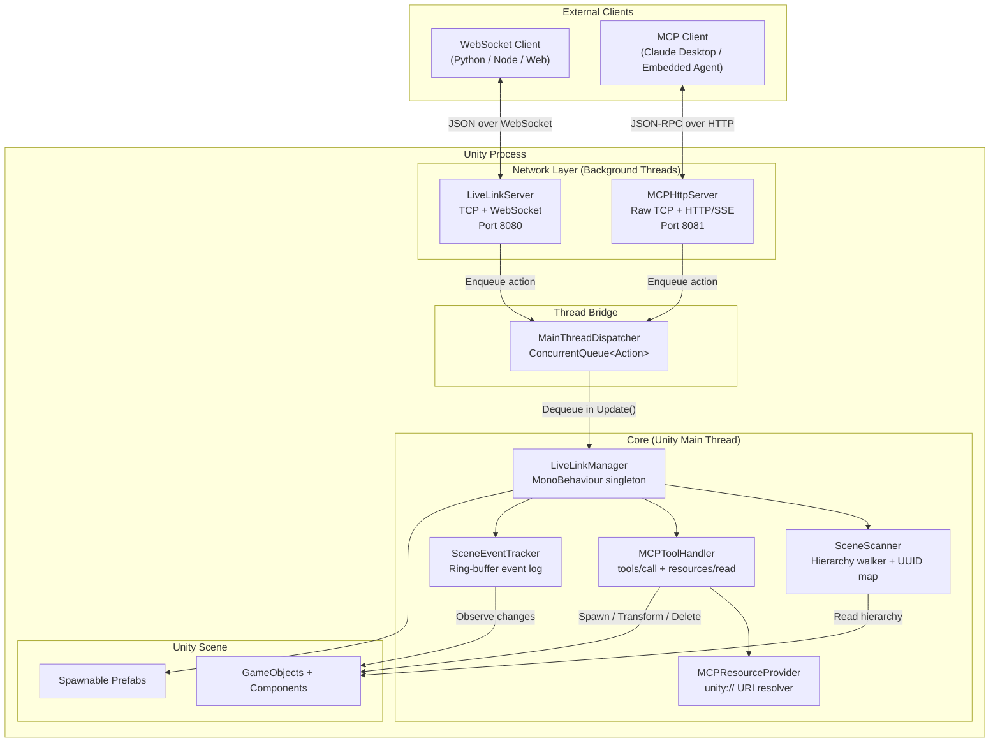
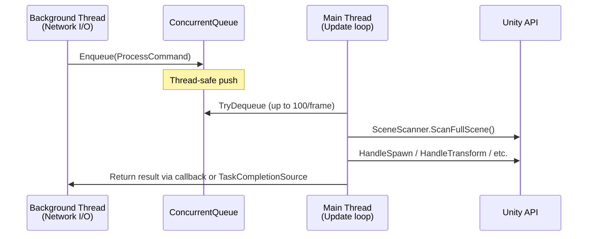

# Architecture & Core Concepts

> **aiia-core-unity (LiveLink)** — A Unity package that exposes scene state and mutation tools to external clients via WebSocket and MCP (Model Context Protocol) HTTP transports.

---

## 1. High-Level Architecture Overview

LiveLink bridges Unity's main-thread-only API with background network I/O. Two independent servers run concurrently, sharing a common dispatcher pattern to marshal work back to the Unity main thread.



### Key Architectural Decisions

| Decision | Rationale |
|----------|-----------|
| Two independent servers on separate ports | WebSocket (8080) serves simple scripting clients; MCP HTTP (8081) serves LLM agents and the embedded runtime. Different protocols, different lifecycles. |
| Raw `TcpListener` instead of `HttpListener` | `HttpListener` requires elevation on Windows and is unavailable on IL2CPP/mobile. Raw sockets work everywhere. |
| `ConcurrentQueue<Action>` thread bridge | Unity API is main-thread-only. All network callbacks are marshalled through a single dispatcher consumed in `Update()`. |
| 12-character truncated UUIDs | Short, human-readable identifiers. Collision risk is negligible for scene-scale object counts but technically possible. |

---

## 2. Core Components

### 2.1 `LiveLinkManager`

**Role:** Central MonoBehaviour orchestrator. Owns the lifecycle of every other component.

**Responsibilities:**
- Starts/stops both servers (`LiveLinkServer` and `MCPHttpServer`)
- Owns the `SceneScanner`, `SceneEventTracker`, `MCPToolHandler`, and `MCPResourceProvider`
- Runs the periodic sync loop in `Update()` at a configurable frequency (default 10 Hz)
- Dispatches incoming WebSocket commands (spawn, transform, delete, rename, set_parent, set_active)
- Manages the spawnable-prefab registry and dynamic MCP tool configuration
- Handles MCP requests delegated from `MCPHttpServer` via `ProcessMcpRequestAsync`

**Lifecycle:**
```
Awake()  → Initialize MainThreadDispatcher, Scanner, EventTracker, ResourceProvider, ToolHandler
Start()  → Auto-start servers if configured
Update() → Tick sync timer, tick cleanup timer
OnDisable() / OnDestroy() → Stop and dispose both servers
```

**Inspector surface:** ~30 serialized fields covering server ports, sync config, prefab list, debug logging, and a comprehensive dynamic MCP tool policy (allow/deny lists, mutation toggles, category/tag filters, cache asset).

---

### 2.2 `SceneScanner`

**Role:** Scene hierarchy walker and UUID registry.

**Responsibilities:**
- Maintains bidirectional mappings: `instanceId ↔ UUID` and `UUID ↔ GameObject`
- `ScanFullScene()` — walks the hierarchy recursively, builds a `SceneDumpPacket` with all `SceneObjectDTO` entries
- `ScanDelta()` — compares current transforms against cached `_lastPositions` / `_lastRotations`, returns only changed objects as a `SyncPacket`
- `CleanupDestroyedObjects()` — garbage-collects entries where the `GameObject` has been destroyed (null Unity object)
- Supports two scopes: `WholeScene` (all root objects) or `TargetObjectOnly` (subtree of a specific transform)

**Data structures held:**
```csharp
Dictionary<int, string>    _instanceIdToUuid   // Unity instance ID → UUID
Dictionary<string, GameObject> _uuidToGameObject // UUID → live GameObject ref
Dictionary<string, Vector3>   _lastPositions    // UUID → last-synced position
Dictionary<string, Quaternion> _lastRotations   // UUID → last-synced rotation
```

---

### 2.3 `MainThreadDispatcher`

**Role:** Thread-safe action queue consumed on Unity's main thread.

**How it works:**
1. Background threads call `Enqueue(Action)` or `EnqueueSafe(Action, string)` to push work items.
2. `Update()` dequeues up to 100 actions per frame (configurable cap to prevent frame stalls).
3. A `volatile bool _queued` flag provides a fast-path early exit when the queue is empty, avoiding `ConcurrentQueue.IsEmpty` checks every frame.

**Design notes:**
- Creates itself as a `DontDestroyOnLoad` singleton if none exists.
- Tracks `_mainThreadId` at initialization for the `IsMainThread` property.
- `ClearQueue()` drains all pending actions — useful for shutdown.

---

### 2.4 `LiveLinkServer`

**Role:** Custom WebSocket server running on a background thread.

**Implementation details:**
- Listens on `IPAddress.Any` via `TcpListener`
- Performs the WebSocket handshake manually (SHA-1 of `Sec-WebSocket-Key` + magic GUID)
- Reads frames in a loop, handling text (opcode `0x1`) and close (opcode `0x8`) frames
- Supports all three payload-length encodings (7-bit, 16-bit, 64-bit)
- Client-to-server frames are masked per spec; server-to-client frames are unmasked
- `Broadcast(string)` fires-and-forgets via `Task.Run(() => BroadcastAsync(message))`
- Connected clients tracked in `List<WebSocketConnection>` guarded by `_clientsLock`

**Connection lifecycle:**
```
AcceptTcpClientAsync → PerformHandshakeAsync → ReadLoopAsync
On disconnect → RemoveClient → Dispose
```

---

### 2.5 `MCPHttpServer`

**Role:** HTTP + SSE server implementing the Model Context Protocol transport layer.

**Endpoints:**

| Path | Method | Behavior |
|------|--------|----------|
| `/mcp` | `POST` | JSON-RPC request → forwarded to `MCPToolHandler` |
| `/mcp` | `GET` | Opens an SSE stream (streamable HTTP transport) |
| `/sse` | `GET` | Legacy SSE: sends `endpoint` event with session-scoped POST URL |
| `/health` | `GET` | Returns server status JSON |

**Session model:**
- Legacy SSE clients receive a `sessionId` via the `endpoint` event
- All subsequent `POST /mcp?sessionId=...` requests must include that session ID
- Sessions track initialization state (`initialize` must be called first)
- Sessions expire after 5 minutes of inactivity; a background cleanup task runs every 30 seconds
- Streamable HTTP clients (POST to `/mcp` without sessionId) bypass session validation entirely

**Request routing:**
- `initialize` and `notifications/initialized` are processed directly on the background thread
- All other methods are dispatched to the main thread via `MainThreadDispatcher.Enqueue` + `TaskCompletionSource<MCPResponse>` to bridge async back to the HTTP response

**Consumer discrimination:**
- The `X-LiveLink-Consumer` header distinguishes `embedded-agent` from `external` clients
- This flows through `LiveLinkMcpRequestContext.PushConsumer()` so that `MCPToolHandler` can apply per-consumer tool exposure policies

---

## 3. Data Flow: Unity → External Clients

### 3.1 WebSocket Path (Port 8080)

```
Client connects via ws://localhost:8080/
        │
        ▼
LiveLinkServer accepts TCP, completes WS handshake
        │
        ▼
OnClientConnected fires → MainThreadDispatcher.Enqueue
        │
        ▼
On main thread: SceneScanner.ScanFullScene() → full scene dump JSON
        │
        ▼
LiveLinkServer.SendAsync → WebSocket text frame → Client
        │
        ▼
Periodic Update() tick:
  SceneScanner.ScanDelta() → SyncPacket (only changed objects)
        │
        ▼
LiveLinkServer.Broadcast → all connected clients
```

### 3.2 MCP HTTP Path (Port 8081)

```
Client POSTs JSON-RPC to http://localhost:8081/mcp
        │
        ▼
MCPHttpServer parses HTTP request on background thread
        │
        ▼
Session validation (legacy SSE) or pass-through (streamable HTTP)
        │
        ▼
PacketSerializer.ParseMCPRequest → MCPRequest DTO
        │
        ▼
MainThreadDispatcher.Enqueue + TaskCompletionSource bridge
        │
        ▼
MCPToolHandler.HandleRequestAsync on main thread
        ├── resources/read → MCPResourceProvider resolves unity:// URIs
        ├── tools/call → ExecuteCommandInternal (spawn/transform/delete/etc.)
        ├── tools/list → legacy + dynamic tool enumeration
        ├── prompts/list → returns prompt templates
        └── prompts/get → renders prompt with arguments
        │
        ▼
MCPResponse serialized → HTTP 200 JSON response
```

### 3.3 Delta Sync Algorithm

```
For each tracked object:
  1. Compare current position vs _lastPositions[uuid]
  2. If Vector3.Distance > deltaThreshold → mark changed
  3. Compare current rotation vs _lastRotations[uuid]
  4. If Quaternion.Angle > deltaThreshold → mark changed
  5. If changed: create SceneObjectDTO, update cached values
  6. Recurse into children
```

Scale changes are **not** tracked by delta sync — only position and rotation.

---

## 4. Threading Model



### Thread Responsibilities

| Thread | Runs On | Allowed Operations |
|--------|---------|-------------------|
| **Main Thread** | Unity `Update()` | All Unity API: `GameObject`, `Transform`, `SceneManager`, `Physics`, `Instantiate`, `Destroy` |
| **WebSocket BG Thread** | `Task.Run` from `AcceptConnectionsAsync` | TCP I/O, WebSocket frame encoding/decoding, JSON parsing (read-only) |
| **MCP HTTP BG Thread** | `Task.Run` from `AcceptClientsAsync` | HTTP parsing, session management, SSE heartbeat, JSON-RPC envelope parsing |

### Critical Invariant

**All Unity API calls happen on the main thread.** The `MainThreadDispatcher` is the only bridge. Network threads never touch `GameObject`, `Transform`, or any Unity object directly.

### MCP Request Threading Detail

The `MCPHttpServer` uses a `TaskCompletionSource<MCPResponse>` pattern to bridge the async HTTP handler back to the main thread:

```csharp
// Background thread:
var tcs = new TaskCompletionSource<MCPResponse>();
MainThreadDispatcher.Enqueue(() => {
    _ = ProcessRequestOnMainThreadAsync(method, mcpRequest, ..., tcs);
});
mcpResponse = await tcs.Task;  // Background thread awaits
```

This means the HTTP response is held open until the main thread processes the request. Under heavy load, this can cause HTTP request queuing since the main thread processes one action per dequeue.

---

## 5. Design Issues & Architectural Concerns

### 5.1 Thread Safety

**🔴 `SceneScanner` is not thread-safe but is accessed from network threads.**

The `_uuidToGameObject` dictionary is read in `GetGameObjectByUUID()` which can be called from the MCP HTTP thread (via `MCPToolHandler`). Meanwhile, `ScanFullScene()` and `CleanupDestroyedObjects()` mutate the same dictionaries on the main thread. No synchronization protects these accesses.

**Impact:** Potential `ConcurrentModificationException` or corrupted state under concurrent load.

**🟡 `LiveLinkServer._connectedClients` lock granularity.**

The `_clientsLock` protects list membership, but `BroadcastAsync` copies the list under lock then iterates outside it. If a client disconnects during iteration, `SendAsync` will fail silently (caught by empty `catch`). This is acceptable but means broadcast errors are invisible.

**🟡 `Broadcast()` is fire-and-forget.**

```csharp
public void Broadcast(string message)
{
    Task.Run(() => BroadcastAsync(message));
}
```

Exceptions in `BroadcastAsync` are swallowed. If a client is slow or disconnected, messages are lost without any backpressure or retry mechanism.

### 5.2 Resource Management

**🔴 `async void ProcessMcpRequestAsync` in `LiveLinkManager`.**

```csharp
private async void ProcessMcpRequestAsync(MCPRequest request, WebSocketConnection client)
```

`async void` methods cannot be awaited and their exceptions are thrown on the synchronization context, potentially crashing the application. If `_mcpHandler.HandleRequestAsync` throws before the `try` block, the exception propagates unobserved.

**🟡 WebSocket connections lack heartbeat/ping.**

The `LiveLinkServer` has no keepalive mechanism. A silently dropped TCP connection (e.g., network switch failure) will remain in `_connectedClients` indefinitely until the next `SendAsync` fails. The `MCPHttpServer` has SSE heartbeats (30s), but the WebSocket server does not.

**🟡 No graceful shutdown drain.**

`StopServer()` disposes all clients immediately. In-flight `SendAsync` calls may throw `ObjectDisposedException`. There's no drain period or cancellation token propagation to in-flight operations.

### 5.3 Performance

**🟡 `CleanupDestroyedObjects()` is O(n × m).**

For each destroyed UUID, it linearly scans `_instanceIdToUuid` to find the matching instance ID. With thousands of tracked objects and frequent destruction, this becomes quadratic. A reverse mapping (`UUID → instanceId`) would make it O(1) per entry.

**🟡 Delta sync walks the entire hierarchy even when nothing changed.**

`ScanDelta()` recurses through every active transform on every call. For scenes with thousands of objects, this is expensive even when no changes exist. A dirty-flag system (e.g., `Transform.hasChanged` or `OnTransformChanged` callbacks) would be more efficient.

**🟡 Full scene dump on every new client connection.**

`OnClientConnected` triggers `ScanFullScene()` which serializes the entire hierarchy as JSON. For large scenes, this can be megabytes and blocks the main thread during serialization.

**🟡 `HandleGetViewContext` with `includeVisibleObjects` is expensive.**

It iterates all tracked objects, gets their `Renderer`, checks `isVisible`, then tests against frustum planes — all in a single frame on the main thread.

### 5.4 Robustness

**🟡 No message size limits on WebSocket frames.**

A malicious client could send a frame with a 64-bit length field claiming gigabytes of payload, causing an `OutOfMemoryException` when allocating the `byte[] payload` buffer.

**🟡 No authentication on either transport.**

Both servers bind to `IPAddress.Any` with no auth. Any process on the network can connect, read scene data, and issue commands (including `delete_object`). The README documents this as a feature for local development but doesn't warn about production exposure.

**🟡 `PacketSerializer.ParseMCPRequest` fallback in `ProcessCommand`.**

Every incoming WebSocket message is first tested as an MCP request, then parsed as a legacy command. If the message is neither, the MCP parser may throw internally before the legacy parser runs. Error handling here is fragile.

**🟡 UUID collision risk.**

UUIDs are 12 hex characters (48 bits). With ~77,000 objects, birthday-paradox collision probability reaches 50%. For large scenes or long-running sessions with many spawns, this could cause silent object aliasing.

### 5.5 Code Quality

**🟡 Mixed async patterns.**

`LiveLinkManager.ProcessMcpRequestAsync` is `async void`. `LiveLinkServer.Broadcast` is `void` (fire-and-forget `Task.Run`). `MCPHttpServer.HandleMCPRequestAsync` is properly `async Task`. The inconsistency makes error propagation unpredictable.

**🟡 `string.ToLowerInvariant()` in switch statements.**

`ExecuteCommandInternal` calls `command.Type.ToLowerInvariant()` for every case. Using a case-insensitive dictionary or `StringComparer.OrdinalIgnoreCase` comparison would be cleaner and avoid allocations.

**🟡 Duplicate scene dump logic.**

`ProcessCommand` calls `ExecuteCommandInternal` for all commands, but `scene_dump` is handled twice — once inside `ExecuteCommandInternal` (returns `ResponsePacket`) and again in `ProcessCommand` (sends the full dump as a raw packet). The `ExecuteCommandInternal` result for `scene_dump` is silently discarded.

---

## 6. Refactoring Suggestions

### 6.1 Thread Safety

1. **Add `ReaderWriterLockSlim` to `SceneScanner`.** Wrap all dictionary reads in `EnterReadLock` and all mutations in `EnterWriteLock`. Alternatively, use `ConcurrentDictionary` for `_uuidToGameObject` and `_instanceIdToUuid`.

2. **Eliminate the `async void` in `ProcessMcpRequestAsync`.** Return `Task` and handle exceptions explicitly. If the caller requires `void`, wrap in `try/catch` with `TaskScheduler.UnobservedTaskException`.

3. **Add a reverse mapping in `SceneScanner`.** Store `Dictionary<string, int> _uuidToInstanceId` to make `CleanupDestroyedObjects()` O(n) instead of O(n × m).

### 6.2 Performance

4. **Implement dirty-flag delta sync.** Use `Transform.hasChanged` (set by Unity when a transform is modified) or a component-based `OnTransformChanged` callback to maintain a `HashSet<string>` of dirty UUIDs. `ScanDelta()` then only inspects dirty entries.

5. **Async scene serialization.** Move JSON serialization off the main thread. Build a snapshot DTO on the main thread (fast), then serialize to JSON string on a background thread (slow for large scenes).

6. **Batch main-thread operations.** Instead of dequeuing one action per iteration, drain the entire queue into a local list and execute all in one frame. The current 100-per-frame cap is arbitrary and creates unnecessary latency.

### 6.3 Robustness

7. **Add WebSocket frame size limits.** Reject frames larger than a configurable maximum (e.g., 1 MB) before allocating the payload buffer.

8. **Add authentication.** At minimum, support a shared-secret token passed as a query parameter or header. For production, consider HMAC-signed session tokens.

9. **Add WebSocket ping/pong.** Send periodic ping frames (e.g., every 30 seconds) and disconnect clients that don't respond with pong within a timeout.

10. **Increase UUID length.** Use full 128-bit GUIDs (`Guid.NewGuid().ToString("D")`) or at minimum 16+ hex characters to eliminate collision risk for large scenes.

### 6.4 Code Quality

11. **Unify the scene dump path.** Remove the duplicate handling in `ProcessCommand` and `ExecuteCommandInternal`. Have `ExecuteCommandInternal` return the dump as a `ResponsePacket`, and let `ProcessCommand` serialize and send it uniformly.

12. **Replace `ToLowerInvariant()` switch with a `Dictionary<string, Func>`.** Register command handlers once at initialization, then dispatch via dictionary lookup with `StringComparer.OrdinalIgnoreCase`.

13. **Extract the WebSocket protocol implementation.** The manual frame encoding/decoding in `LiveLinkServer` and `WebSocketConnection` is ~200 lines of low-level byte manipulation. Consider extracting it into a `WebSocketProtocol` utility class with clear separation between framing and application logic.

14. **Add `IDisposable` consistently.** `SceneScanner`, `MCPToolHandler`, and `MCPResourceProvider` hold references but don't implement `IDisposable`. If `LiveLinkManager` is destroyed and recreated, stale references may persist.

15. **Unify error response format.** WebSocket commands return `ResponsePacket` with `Type: "response"`. MCP returns JSON-RPC error objects. Consider a shared error DTO or at least consistent error code ranges.

---

## Appendix: Component Dependency Graph

```
LiveLinkManager
├── LiveLinkServer          (WebSocket, IDisposable)
│   └── WebSocketConnection (per client, IDisposable)
├── MCPHttpServer           (HTTP+SSE, IDisposable)
│   ├── MCPSession          (per session)
│   └── McpSseConnection    (per SSE stream, IDisposable)
├── SceneScanner            (plain class, no disposal)
├── MCPToolHandler          (plain class, no disposal)
│   └── LiveLinkToolRegistry (dynamic tool discovery)
├── MCPResourceProvider     (plain class, no disposal)
│   └── SceneEventTracker   (MonoBehaviour, auto-created)
└── MainThreadDispatcher    (static singleton, DontDestroyOnLoad)
```
