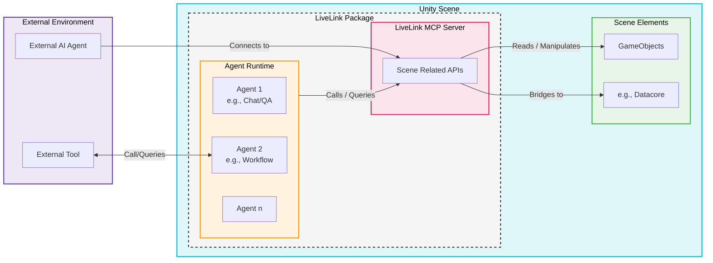

# Aroaro LiveLink for Unity

LiveLink is a dedicated Unity package designed to bring advanced, extensible AI capabilities into your game scenes. Built upon the robust foundation of the Microsoft Agent Framework, LiveLink acts as both a runtime environment for AI entities and a direct communications bridge to the Unity engine's internal data.

## Features

- 🔌 **Drop-and-Play**: Add a `LiveLinkManager` component to your scene
- 🎯 **Configurable Scope**: Sync the entire hierarchy or just a specific branch
- 📡 **Bidirectional Communication**: Read scene state and send commands from external apps
- ⚡ **Delta Sync**: Efficient updates that only transmit changed objects
- 🔧 **Prefab Spawning**: Spawn registered prefabs from external commands
- 🖥️ **Custom Editor**: Easy-to-use inspector with status display and controls
- 🤝 **MCP Support**: JSON-RPC endpoint exposing scene resources and Unity tools

## Understanding LiveLink in Unity App

Here is a breakdown of the core components and capabilities as illustrated in the architecture diagram below:

**Agent Runtime Environment:** LiveLink provides a specialized runtime (managed by the Microsoft Agent Framework) within the Unity Scene. This environment hosts multiple AI agents, supporting multi-agent collaboration or individual specialization. Examples include:

- **Chat/QA Agents:** For interactive dialogue and querying.
- **Workflow Agents:** For managing multi-step tasks or scene processes.
- **Extensible Agents:** A modular system allows you to build custom agents tailored to specific game logic or even interface with External Tools/Editor Extensions for configuration and direct control.

**LiveLink MCP Server (Scene-Related APIs):** This is the heart of the package's integration with Unity. The MCP (Model Context Protocol) Server serves as a single interface for agents to interact with the scene. It provides distinct APIs that agents can call to:

- **List and Query Scene Objects:** Retrieve the current state of GameObjects.
- **Manipulate Properties:** Change GameObject states (position, rotation, etc.) or execute component methods.
- **Broadcast Events and Bridge Methods:** Connect AI-driven decisions to native Unity events or trigger game functions.

**External Integration & High-Speed Links:** LiveLink is designed for flexibility. It can operate locally within the Unity Scene or interface with an External AI Core (off-device) over high-speed data links for complex reasoning or data access. This allows external, powerful models to control the internal Unity scene seamlessly through the MCP Server interface.

### Architecture Diagram



## Additional Documentation

- [Embedded Agent Framework MVP](Documentation~/Embedded-Agent-Framework-MVP.md) - architecture for embedding Microsoft Agent Framework in the Unity app, using LiveLink MCP as the default first-party capability server and allowing users to attach additional downstream MCP servers for the embedded agent.
- [External Tool Bridge Guide](Documentation~/External-Tool-Bridge-Guide.md) - how third-party developers expose tools with zero source-code intrusion via manifest mapping.

## Embedded Agent Runtime

The package now includes an embedded Microsoft Agent Framework runtime for single-app Unity deployments.

- Add an `EmbeddedAgentRuntime` component when you want in-app QA and tool calling.
- Create an `AgentRuntimeConfig` asset to configure the model, the default local LiveLink MCP connection, and any optional downstream MCP servers.
- Use `LiveLink > Create Agent Runtime Config` to create the config asset from the Unity menu.
- LiveLink MCP remains the default first-party server for the embedded agent.
- Downstream MCP servers are configured for the agent only and are not bridged back through LiveLink MCP.
- Stdio-based downstream MCP servers are intended for the Unity Editor and standalone desktop players.

## Dynamic Tool Bridge (Annotation Based)

LiveLink MCP now supports dynamic tool discovery from annotated C# methods, so Unity app code (including third-party code) can be exposed as MCP tools without editing `MCPToolHandler` switch tables.

### How Discovery Works

- Mark static methods with `LiveLinkToolAttribute`.
- Optional `LiveLinkToolParameterAttribute` can override argument names and descriptions.
- LiveLink scans runtime assemblies and registers discovered tools.
- `tools/list` and `tools/call` route through dynamic registry first, then fallback to legacy built-ins.

### Zero-Intrusion Manifest Mode

If a third-party package should not depend on `LiveLink.Tools`, use manifest mapping:

- Create one or more `LiveLinkToolManifest` assets.
- For each entry, provide `Assembly Name`, `Type Name`, and static `Method Name`.
- Add those assets to `LiveLinkManager > Dynamic MCP Tools > Tool Manifest Assets`.
- LiveLink resolves and exposes methods as MCP tools without changing third-party source code.

Manifest mode and attribute mode can be used together.

### Example

```csharp
using LiveLink.Tools;

public static class MyGameplayTools
{
  [LiveLinkTool(
    "my_gameplay_ping",
    Description = "Simple diagnostics tool",
    Visibility = LiveLinkToolVisibility.Both,
    RequiresMainThread = false,
    IsMutation = false,
    Category = "utility",
    Tags = new[] { "diagnostic" })]
  public static object Ping([LiveLinkToolParameter("text", Required = true)] string text)
  {
    return new { echoed = text };
  }
}
```

### Exposure Policy

Use `LiveLinkManager > Dynamic MCP Tools` to configure:

- discovery assembly allow-list
- separate exposure toggles for embedded agent and external MCP clients
- separate mutation-tool toggles for embedded agent and external MCP clients
- allow/deny lists for agent and external clients
- optional category/tag filters

The embedded agent local MCP client now sends `X-LiveLink-Consumer: embedded-agent`, allowing server-side policy to distinguish embedded-agent calls from external calls.

## Installation

### Via Unity Package Manager (Git URL)

1. Open Unity and go to **Window > Package Manager**
2. Click the **+** button in the top-left corner
3. Select **Add package from git URL...**
4. Enter the following URL (including `.git` at the end):

```
https://github.com/Stlouislee/aiia-core-unity.git
```

5. Click **Add** and wait for the package to download and import

### Manual Installation

1. Clone or download this repository
2. Copy the contents into your project's `Packages/com.livelink.core/` folder

The Agent Framework and MCP client dependencies are vendored inside `Runtime/Plugins/AgentFramework` and explicitly referenced by `LiveLink.AgentRuntime`, so the package can be imported without adding NuGet tooling to Unity.

## Quick Start

### 1. Add LiveLink Manager to Your Scene

- Go to **LiveLink > Create Manager** in the Unity menu
- Or create an empty GameObject and add the `LiveLinkManager` component

### 2. Configure the Manager

| Property | Description |
|----------|-------------|
| **Port** | WebSocket server port (default: 8080) |
| **MCP Port** | MCP HTTP server port (default: 8081) |
| **Enable MCP Server** | Enable the MCP HTTP server on `/mcp` with legacy `/sse` compatibility |
| **Auto Start** | Start server automatically on Play |
| **Enable Dynamic MCP Tools** | Discover and expose tools from annotated methods |
| **Scope** | `WholeScene` or `TargetObjectOnly` |
| **Target Root** | Root object when using TargetObjectOnly scope |
| **Sync Frequency** | Updates per second (0 = manual only) |
| **Delta Sync** | Only send changed objects |
| **Spawnable Prefabs** | Prefabs that can be instantiated via commands |

### 3. Enter Play Mode

The server will start automatically (if Auto Start is enabled) and begin accepting WebSocket connections.

### 4. Optional: Add the Embedded Agent

- Create a config asset from `LiveLink > Create Agent Runtime Config`.
- Add `EmbeddedAgentRuntime` to a GameObject.
- Assign the config asset and a `LiveLinkManager`.
- Press Play to let the runtime connect to the local LiveLink MCP server and any enabled downstream MCP servers.

### 5. AgentRuntimeConfig Example

Typical MVP setup:

- `Agent Name`: `LiveLink Agent`
- `OpenAI Model`: `gpt-4o-mini`
- `Prefer Environment API Key`: enabled
- `API Key Environment Variable`: `OPENAI_API_KEY`
- `System Instructions`: tell the agent to inspect the Unity scene through MCP before answering
- `Enable Local LiveLink MCP`: enabled
- `Auto Start Local MCP`: enabled
- `HTTP Transport Mode`: `StreamableHttp`
- `Connection Timeout`: `15`
- `Allow Scene Mutation Tools`: enabled for editing flows, disabled for read-only QA
- `Enable Persistent Chat History`: enabled when you want durable local conversation memory
- `Conversation ID`: `default` (or app/user-specific value if you need separate history streams)
- `Storage Subdirectory`: `LiveLink/AgentHistory`
- `Max Persisted Messages`: `200`
- `Max File Size (Bytes)`: `1048576`

Example downstream HTTP MCP server:

- `Display Name`: `Docs MCP`
- `Enabled`: enabled
- `Transport Type`: `Http`
- `Endpoint`: your MCP SSE or streamable HTTP endpoint
- `HTTP Transport Mode`: `StreamableHttp`
- `Connection Timeout`: `30`
- `Headers`: optional auth headers such as `Authorization: Bearer ...`

Example downstream stdio MCP server:

- `Display Name`: `Filesystem MCP`
- `Enabled`: enabled
- `Transport Type`: `Stdio`
- `Command`: the server executable
- `Arguments`: startup arguments for that MCP server
- `Working Directory`: optional process working directory
- `Environment Variables`: optional process environment entries

Field guide:

- `Agent Name` controls the logical name seen by the agent runtime.
- `OpenAI Model` selects the chat model used for reasoning and tool selection.
- `Prefer Environment API Key` keeps secrets out of the asset when possible.
- `Fallback API Key` is only used when the configured environment variable is missing.
- `Enable Local LiveLink MCP` keeps your first-party Unity MCP surface available to the embedded agent.
- `HTTP Transport Mode` for the built-in LiveLink MCP should normally stay on `StreamableHttp`; legacy `Sse` is only for backward compatibility.
- `Allow Scene Mutation Tools` gates write operations such as spawn, transform, delete, rename, reparent, and active-state changes.
- `Enable Persistent Chat History` stores chat history to local files under `Application.persistentDataPath`.
- `Conversation ID` selects which persisted history stream is resumed across restarts.
- `Storage Subdirectory` controls the relative location under `Application.persistentDataPath`.
- `Max Persisted Messages` caps restored history and trims oldest entries first.
- `Max File Size (Bytes)` sets a warning threshold to detect oversized history files.
- `Use Tool Allow List` on an external server lets you expose only selected tools from that server to the agent.

### 6. External UI Event Hooks

`EmbeddedAgentRuntime` now exposes UnityEvents that can be wired directly from custom UI components:

- `OnResponseReceived` (`UnityEvent<string>`) - final text response from the agent.
- `OnError` (`UnityEvent<string>`) - initialization/request errors.
- `OnStatusChanged` (`UnityEvent<string>`) - runtime progress such as connecting, running, and ready states.
- `OnToolCall` (`UnityEvent<string, string>`) - tool invocation notifications (`toolName`, `jsonParameters`).

These events are public on the component and visible in the inspector, so UI prefabs can subscribe without modifying package code.

`AgentRuntimeConfig` already exposes public getters (for example `OpenAIModel`) so UI code can display active runtime settings.

## Communication Protocol

Unity LiveLink provides two transport mechanisms for different use cases:

### Transport Comparison

| Feature | **WebSocket** (Port 8080) | **MCP HTTP** (Port 8081) |
|---------|--------------------------|--------------------------|
| **Protocol** | Custom JSON | MCP (Model Context Protocol) |
| **Primary Endpoint** | `ws://localhost:8080/` | `http://localhost:8081/mcp` |
| **Session Management** | Implicit (connection-based) | Streamable HTTP by default, legacy session-based SSE supported |
| **Authentication** | None | Session-based validation |
| **Bidirectional** | Yes (full duplex) | Request/Response, optional SSE stream |
| **Auto-reconnect** | Client handles | Client must re-establish session |
| **Use Case** | Simple scripting, real-time sync | LLM agents, MCP-compatible tools |
| **Initialization** | Automatic scene dump on connect | Explicit `initialize` handshake |

**Choose WebSocket when:**
- Building simple automation scripts
- Need low-latency bidirectional communication
- Don't require MCP standard compliance

**Choose MCP HTTP when:**
- Integrating with MCP-compatible LLM clients (Claude Desktop, etc.)
- Need explicit session lifecycle control
- Require RESTful request/response pattern

---

### WebSocket Transport (Port 8080)

All communication uses JSON over WebSocket. Connect to `ws://localhost:8080/` (or your configured port).

### MCP (Model Context Protocol) - HTTP Transport (Port 8081)

Unity LiveLink implements the official MCP HTTP+SSE transport specification with full session management.
The MCP server listens on all interfaces. Use `localhost` when the client runs on the same machine, or the device IP / port forwarding when Unity is running on Android or Quest.

#### Session Workflow

1. **Preferred transport: Streamable HTTP**
   - Send MCP JSON-RPC requests directly to `POST /mcp`
   - Start with `initialize`, then `notifications/initialized`, then normal MCP methods
   - This is the recommended path for the embedded agent and modern MCP SDKs

2. **Legacy compatibility transport: HTTP+SSE**
   - Connect to `GET /sse`
   - Server sends an `endpoint` event containing `POST /mcp?sessionId={sessionId}`
   - Keep the SSE connection alive while posting requests to that session endpoint

3. **Legacy session validation**
   - `initialize`: creates session state
   - Other methods: require a valid initialized legacy SSE session
   - Error codes: `-32001` (session required), `-32002` (not initialized)

#### Available Methods

- `initialize` → Handshake with server capabilities
- `resources/list` → Returns MCP resource templates for reading Unity scene data
- `resources/read` → Returns content for a resource URI (see Resource URIs below)
- `tools/list` → Returns available tools
- `tools/call` → Invokes a tool (`spawn_object`, `transform_object`, `delete_object`, etc.)
- `prompts/list` → Returns reusable MCP workflow prompts exposed by the server
- `prompts/get` → Returns a rendered prompt template with optional arguments

### MCP Resource URIs

The server exposes Unity scene data through the `unity://` URI scheme:

| URI | Description |
|-----|-------------|
| `unity://scene/active` | Basic scene info (name, path, root count, render pipeline, time, quality, platform, Unity version) |
| `unity://scene/hierarchy?root=/&depth=2` | Hierarchy tree with configurable root path and depth |
| `unity://go/{instanceId}` | GameObject metadata (name, tag, layer, active state, parent, children, component count, full transform) |
| `unity://go/{instanceId}/components` | Component list with types, instance IDs, and enabled states |
| `unity://component/{instanceId}/{componentType}` | Component field snapshot (all public fields and properties) |
| `unity://selection` | Currently selected objects in the Unity Editor |
| `unity://events/recent?count=50` | Recent scene events (create, delete, transform change, parent change, etc.) |

#### Resource Examples

**Read active scene info:**
```json
{"jsonrpc":"2.0","id":2,"method":"resources/read","params":{"uri":"unity://scene/active"}}
```

Response:
```json
{
  "jsonrpc": "2.0",
  "id": 2,
  "result": {
    "contents": [{
      "uri": "unity://scene/active",
      "mimeType": "application/json",
      "text": "{\"scene_name\":\"SampleScene\",\"root_count\":5,\"object_count\":42,\"render_pipeline\":\"URP\",\"time_scale\":1.0,\"unity_version\":\"2022.3.10f1\"}"
    }]
  }
}
```

**Read scene hierarchy (depth 3):**
```json
{"jsonrpc":"2.0","id":3,"method":"resources/read","params":{"uri":"unity://scene/hierarchy?depth=3"}}
```

**Read a specific GameObject:**
```json
{"jsonrpc":"2.0","id":4,"method":"resources/read","params":{"uri":"unity://go/12345"}}
```

**Read components on a GameObject:**
```json
{"jsonrpc":"2.0","id":5,"method":"resources/read","params":{"uri":"unity://go/12345/components"}}
```

**Read a specific component's fields:**
```json
{"jsonrpc":"2.0","id":6,"method":"resources/read","params":{"uri":"unity://component/12345/MeshRenderer"}}
```

**Read current editor selection:**
```json
{"jsonrpc":"2.0","id":7,"method":"resources/read","params":{"uri":"unity://selection"}}
```

**Read recent events:**
```json
{"jsonrpc":"2.0","id":8,"method":"resources/read","params":{"uri":"unity://events/recent?count=20"}}
```

#### Example Session Flow

```json
**Legacy SSE Example - Step 1: Connect to SSE**
```
GET http://localhost:8081/sse
```
Server responds with:
```
event: endpoint
data: /mcp?sessionId=a1b2c3d4...
```

**Step 2: Initialize session**
```json
POST http://localhost:8081/mcp?sessionId=a1b2c3d4...

{
  "jsonrpc": "2.0",
  "id": 1,
  "method": "initialize",
  "params": {
    "protocolVersion": "2025-11-25",
    "capabilities": {},
    "clientInfo": {
      "name": "My MCP Client",
      "version": "1.0.0"
    }
  }
}
```

**Step 3: Use MCP methods**
```json
POST http://localhost:8081/mcp?sessionId=a1b2c3d4...

{"jsonrpc":"2.0","id":2,"method":"resources/read","params":{"uri":"unity://scene/active"}}
```

Response:
```json
{
  "jsonrpc": "2.0",
  "id": 2,
  "result": {
    "contents": [
      {
        "uri": "unity://scene/active",
        "mimeType": "application/json",
        "text": "{\"scene_name\":\"SampleScene\",\"root_count\":3,\"object_count\":15,\"render_pipeline\":\"Built-in\",\"time_scale\":1.0}"
      }
    ]
  }
}
```

**Example: Call a tool**

```json
POST http://localhost:8081/mcp?sessionId=a1b2c3d4...

{
  "jsonrpc": "2.0",
  "id": 3,
  "method": "tools/call",
  "params": {
    "name": "spawn_object",
    "arguments": {
      "prefab_key": "Cube",
      "position": [0, 1, 0],
      "name": "MCP Cube"
    }
  }
}
```

**Example: Get a prompt**

```json
POST http://localhost:8081/mcp?sessionId=a1b2c3d4...

{
  "jsonrpc": "2.0",
  "id": 4,
  "method": "prompts/get",
  "params": {
    "name": "spawn_from_intent",
    "arguments": {
      "intent": "Create a small obstacle course in front of the player",
      "count": 5,
      "placement_strategy": "front_of_camera"
    }
  }
}
```

**Session Errors**

- **-32001**: Session required - legacy SSE clients must connect to `/sse` first to obtain a `sessionId`
- **-32002**: Session not initialized - Send `initialize` method before other operations
- Session expires after 5 minutes of inactivity

See `mcp-config.example.json` for a ready-to-copy client config.

### Available MCP Prompts

- `scene_analysis` - Analyze hierarchy hotspots and propose concrete MCP tool actions.
- `spawn_from_intent` - Turn natural-language level design intent into spawn/transform operations.
- `object_repair` - Diagnose and repair transform/parenting issues for a target UUID.
- `scene_cleanup` - Produce (and optionally execute) a safe cleanup plan for redundant objects.

### Available MCP Tools

#### Core Scene Management

**`spawn_object`** - Spawn a new object from a prefab
```json
{
  "name": "spawn_object",
  "arguments": {
    "prefab_key": "Cube",
    "position": [0, 1, 0],
    "rotation": [0, 0, 0, 1],
    "scale": [1, 1, 1],
    "name": "My Cube",
    "parent_uuid": "parent-uuid"
  }
}
```

**`spawn_gltf`** - Spawn a glTF asset at runtime (via Unity glTFast)

Load from URL:
```json
{
  "name": "spawn_gltf",
  "arguments": {
    "url": "https://example.com/model.glb",
    "position": [0, 1, 0],
    "rotation": [0, 0, 0, 1],
    "scale": [1, 1, 1],
    "name": "Imported glTF"
  }
}
```

Load from base64-encoded `.glb`:
```json
{
  "name": "spawn_gltf",
  "arguments": {
    "data_base64": "<base64 glb bytes>",
    "source_uri": "file:///memory.glb",
    "name": "Imported glTF"
  }
}
```

**`transform_object`** - Update position, rotation, or scale
```json
{
  "name": "transform_object",
  "arguments": {
    "uuid": "object-uuid",
    "position": [10, 0, 10],
    "rotation": [0, 0.5, 0, 0.866],
    "scale": [2, 2, 2]
  }
}
```

**`delete_object`** - Delete an object from the scene
```json
{
  "name": "delete_object",
  "arguments": {
    "uuid": "object-uuid"
  }
}
```

**`scene_dump`** - Get full scene hierarchy
```json
{
  "name": "scene_dump",
  "arguments": {
    "include_inactive": false
  }
}
```

#### Context and Discovery

**`list_spawnable_objects`** - Get available prefab names
```json
{
  "name": "list_spawnable_objects",
  "arguments": {}
}
```
**Response:** `{"prefabs": ["Cube", "Sphere"], "count": 2}`

**`get_view_context`** - Get camera/player perspective
```json
{
  "name": "get_view_context",
  "arguments": {
    "camera_tag": "MainCamera",
    "include_visible_objects": true,
    "raycast_distance": 100
  }
}
```
**Returns:** Camera position, orientation, forward/right/up vectors, field of view, raycast hit info, and optionally visible objects.

#### Read-Optimized Agent Tools

These tools mirror the `unity://` resources but are easier for embedded agents to use during QA flows.

- `read_scene_info` - Read the active scene summary
- `read_scene_hierarchy` - Read the hierarchy tree with configurable depth
- `read_object` - Read one GameObject by `uuid` or `instance_id`
- `read_object_components` - Read the components attached to a GameObject
- `read_component_snapshot` - Read a specific component snapshot
- `read_selection` - Read the current Unity Editor selection
- `read_recent_events` - Read tracked scene events

#### Additional Mutation Tools

- `rename_object` - Rename an existing GameObject
- `set_parent` - Reparent a GameObject
- `set_active` - Enable or disable a GameObject

#### Planned Tools

**`get_snapshot`** - Capture camera view as image (planned)
- **Arguments:** `width`, `height`, `quality`, `format`, `camera_tag`
- **Returns:** Base64-encoded image with metadata
- **Cross-platform:** Windows, macOS, Linux, iOS, Android, VR, WebGL

---

### Receiving Scene Data

When a client connects, it receives a full scene dump:

```json
{
  "type": "scene_dump",
  "timestamp": 1702234567890,
  "payload": {
    "root_id": "scene_root",
    "scene_name": "SampleScene",
    "object_count": 5,
    "objects": [
      {
        "uuid": "abc123def456",
        "parent_uuid": null,
        "name": "Player",
        "active": true,
        "layer": 0,
        "tag": "Player",
        "transform": {
          "pos": [0, 1, 0],
          "rot": [0, 0, 0, 1],
          "scale": [1, 1, 1]
        },
        "children": ["child-uuid-1", "child-uuid-2"]
      }
    ]
  }
}
```

### Sync Updates

Periodic sync messages contain only changed objects:

```json
{
  "type": "sync",
  "timestamp": 1702234567900,
  "is_delta": true,
  "objects": [
    {
      "uuid": "abc123def456",
      "name": "Player",
      "transform": {
        "pos": [5, 1, 3],
        "rot": [0, 0.707, 0, 0.707],
        "scale": [1, 1, 1]
      }
    }
  ]
}
```

### Sending Commands

#### Spawn Object

```json
{
  "type": "spawn",
  "request_id": "req-001",
  "payload": {
    "prefab_key": "Cube",
    "id": "my-custom-id",
    "position": [5, 0, 5],
    "rotation": [0, 0, 0, 1],
    "scale": [2, 2, 2],
    "name": "My Cube"
  }
}
```

#### Transform Object

```json
{
  "type": "transform",
  "request_id": "req-002",
  "payload": {
    "uuid": "abc123def456",
    "position": [10, 0, 10],
    "rotation": [0, 0.5, 0, 0.866],
    "local": false
  }
}
```

#### Delete Object

```json
{
  "type": "delete",
  "request_id": "req-003",
  "payload": {
    "uuid": "abc123def456"
  }
}
```

#### Request Scene Dump

```json
{
  "type": "scene_dump",
  "request_id": "req-004",
  "payload": {
    "include_inactive": false
  }
}
```

#### Other Commands

- `rename` - Rename an object
- `set_parent` - Change object parent
- `set_active` - Enable/disable object
- `ping` - Health check (responds with "pong")

### Response Format

Commands receive a response:

```json
{
  "type": "response",
  "timestamp": 1702234567890,
  "success": true,
  "message": "Object spawned",
  "request_id": "req-001",
  "data": {
    "uuid": "new-object-uuid",
    "name": "My Cube"
  }
}
```

## Python Client Example

```python
import asyncio
import websockets
import json

async def connect_to_unity():
    uri = "ws://localhost:8080"
    
    async with websockets.connect(uri) as websocket:
        # Receive initial scene dump
        scene_data = await websocket.recv()
        scene = json.loads(scene_data)
        print(f"Connected! Scene has {scene['payload']['object_count']} objects")
        
        # Spawn a cube
        spawn_command = {
            "type": "spawn",
            "request_id": "py-001",
            "payload": {
                "prefab_key": "Cube",
                "position": [0, 2, 0],
                "name": "Python Cube"
            }
        }
        await websocket.send(json.dumps(spawn_command))
        
        # Wait for response
        response = await websocket.recv()
        print(f"Response: {response}")
        
        # Listen for sync updates
        while True:
            message = await websocket.recv()
            data = json.loads(message)
            if data["type"] == "sync":
                print(f"Sync: {len(data['objects'])} objects changed")

# Run the client
asyncio.run(connect_to_unity())
```

### Requirements

```bash
pip install websockets
```

## Node.js Client Example

```javascript
const WebSocket = require('ws');

const ws = new WebSocket('ws://localhost:8080');

ws.on('open', function() {
    console.log('Connected to Unity LiveLink');
    
    // Spawn a cube
    ws.send(JSON.stringify({
        type: 'spawn',
        request_id: 'js-001',
        payload: {
            prefab_key: 'Cube',
            position: [0, 3, 0],
            name: 'JavaScript Cube'
        }
    }));
});

ws.on('message', function(data) {
    const message = JSON.parse(data);
    console.log('Received:', message.type);
    
    if (message.type === 'scene_dump') {
        console.log(`Scene has ${message.payload.object_count} objects`);
    }
});

ws.on('close', function() {
    console.log('Disconnected from Unity');
});
```

## Architecture

```
┌─────────────────────────────────────────────────────────────┐
│                     External Application                      │
│                  (Python / Node.js / Web)                    │
└──────────────────────────┬──────────────────────────────────┘
                           │ WebSocket (JSON)
                           ▼
┌─────────────────────────────────────────────────────────────┐
│                      LiveLinkServer                          │
│                   (Background Thread)                        │
└──────────────────────────┬──────────────────────────────────┘
                           │ ConcurrentQueue<Action>
                           ▼
┌─────────────────────────────────────────────────────────────┐
│                   MainThreadDispatcher                       │
│                    (Unity Main Thread)                       │
└──────────────────────────┬──────────────────────────────────┘
                           │
                           ▼
┌─────────────────────────────────────────────────────────────┐
│                    LiveLinkManager                           │
│          ┌─────────────┴─────────────┐                      │
│          ▼                           ▼                      │
│    SceneScanner              Command Handlers               │
│   (Read Hierarchy)      (Spawn/Transform/Delete)            │
└─────────────────────────────────────────────────────────────┘
```

## Folder Structure

```
com.livelink.core/
├── package.json                    # UPM manifest
├── README.md                       # This file
├── Runtime/
│   ├── LiveLink.asmdef            # Assembly definition
│   └── Scripts/
│       ├── LiveLinkManager.cs     # Main manager component
│       ├── MainThreadDispatcher.cs # Thread-safe dispatcher
│       ├── SceneScanner.cs        # Hierarchy serialization
│       ├── MCP/                   # MCP JSON-RPC support
│       │   ├── McpTypes.cs        # JSON-RPC + MCP DTOs
│       │   └── McpResourceMapper.cs # URI + content helpers
│       └── Network/
│           ├── LiveLinkServer.cs  # WebSocket server
│           └── PacketSchemas.cs   # JSON DTOs
└── Editor/
    ├── LiveLink.Editor.asmdef     # Editor assembly definition
    └── LiveLinkManagerEditor.cs   # Custom inspector
```

## Requirements

- Unity 2020.3 LTS or newer
- Newtonsoft.Json (automatically installed via dependencies)

## Roadmap

- [ ] Component reflection (send generic component data)
- [ ] WebRTC video streaming (GameView render texture)
- [ ] Editor scene control (not just Play Mode)
- [ ] Multiple scene support
- [ ] Custom event system
- [ ] Expanded MCP tools for component data

## License

MIT License - see [LICENSE](LICENSE) for details.

## Contributing

Contributions are welcome! Please feel free to submit a Pull Request.
